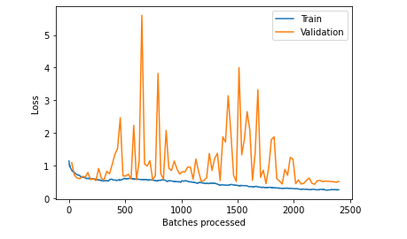

# COVID-19 Diagnosis Using Deep Learning Framework on Chest X-Ray Using FastAI

#### Paritosh Singh

*Chandigarh College of Engineering and Technology (Degree Wing)*
*(Government Institute Under Chandigarh UT Administration | Affiliated to Panjab University, Chandigarh)*

_**Abstract: The exponential rise of COVID-19 has led to a meteoric rise in the deaths by COVID-19. As the healthcare systems around the world adjust to the realities of the post-pandemic world. With a minuscule number of testing kits and delayed vaccine roll-out, screening and diagnosis of every patient with respiratory illness is an uphill task. One of the key screening approaches being radiology examination using chest radiography. It has been found that patients present abnormalities in chest radiography images that are characteristic of those infected with COVID-19. X-Ray machines are already available in most healthcare systems, and with most modern X-Ray systems already digitized, there is no transportation time involved for the samples either. Application of deep learning models on Chest X-Ray Images can help in identifying patients with a high likelihood of COVID-19. In this manner, we can develop a scalable national identification portal that leads to the identification of COVID cases even in remote areas. In this paper, a new model for automatic COVID-19 detection using raw chest X-ray images is presented. The proposed model is developed to provide diagnostics for classification between COVID, No-Findings and Pneumonia. Implementation of 17 convolutional layers and introduced different filtering on each layer.  The model produced a classification accuracy of 80.04% for multi-class cases.**_

Keywords: COVID-19, deep neural networks, deep learning

### Introduction:

As the coronavirus pandemic rapidly sweeps across the world, it is inducing a considerable degree of fear, worry and concern in the population at large and among certain groups in particular, such as older adults, care providers and people with underlying health conditions. As the fear of getting infected deepens so does the fear of getting out of one's house does contributing to deteriorated medical attention to the ones in need as some of the people are too afraid to step into hospitals full of COVID 19 patients. The model we propose can easily dismiss this problem. The patients can have there Chext-X Ray scanned on the  national identification portal.

This will help in:
 - Narrowing down of COVID-19 Cases.
 - Prioritizing the ones with high degree of likeliness.
 - Help in COVID-19 testing especially in areas with less number of COVID cases.

As a response to the situation prevailing all over the world it is absolutely necessary to find reliable means for the diagnosis of the needful. This project caters the same issue letting the patient diagnose some of the diseases within the comforts of their own homes.

### Dataset:

https://github.com/ieee8023/COVID-chestxray-dataset/ 

 

For  COVID-19 Images. The following public open dataset of chest X-ray and CT images of patients which are positive or suspected of COVID-19 or other viral and bacterial pneumonias was utilized.[5] Data was collected from public sources as well as through indirect collection from hospitals and physicians. All images and data will be released publicly in this GitHub repo.

The total images of each type was:
 - COVID: 125 Images
 - No-Findings: 500 Images
 - Pneumonia: 500 Images

Dataset was further partitioned into test, tain and validation sets for each category
 - Total Number of images in training: 778
 - Total  Number of images in validation: 30
 - Total Number of images in test: 317

# Results
 
 
 
 
 

# Conclusions

We have presented some initial results on detecting COVID-19 positive cases from chest X-Rays using a deep-learning model. The results look promising, though the size of the publicly available dataset is small. We plan to further validate our approach using larger COVID-19 X-ray image datasets and clinical trials. Also, such models can be used to diagnose other chest-related diseases including tuberculosis and pneumonia. A limitation of the study is the use of a limited number of COVID19 X-ray images. We intend to make our model more robust and accurate by using more such images from our local hospitals. 
